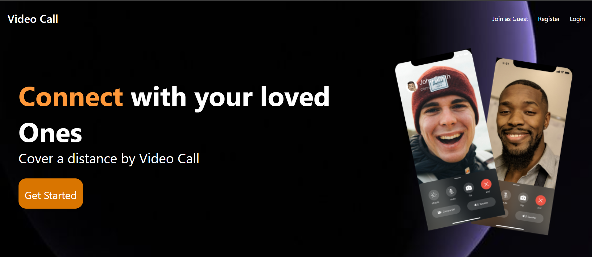
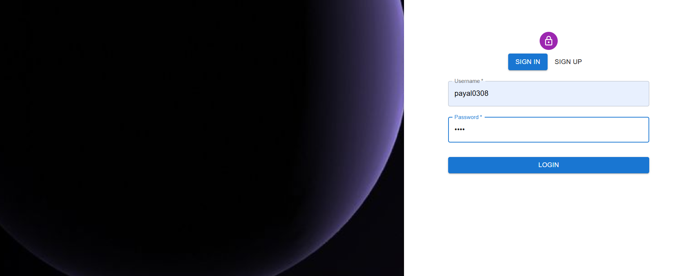
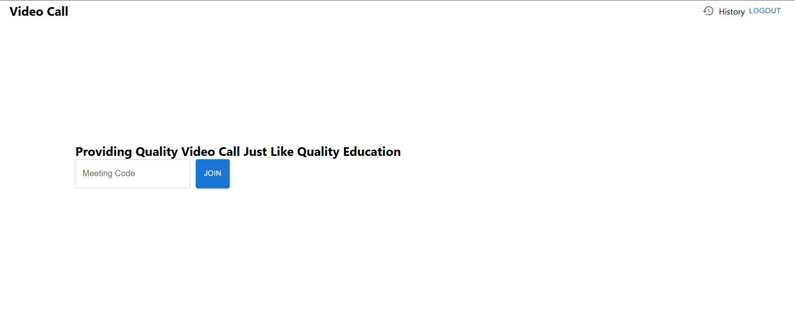
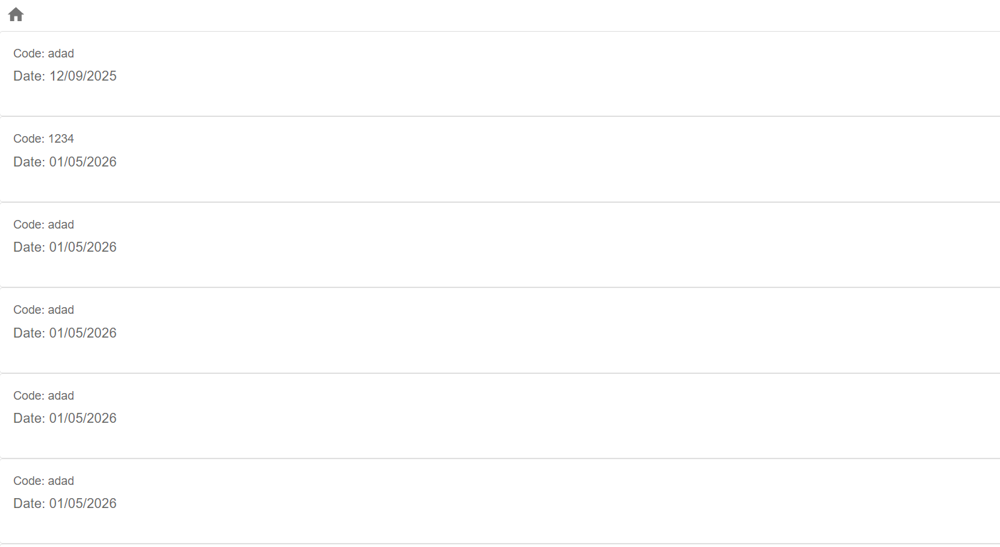

# VideoCall

A full-stack real-time video conferencing application built with React, Node.js, Socket.IO, and WebRTC.

🔴 **Live Demo** → [video-call-khaki-eight.vercel.app](https://video-call-khaki-eight.vercel.app)

---

## Screenshots

### Landing Page


### Login / Register


### Home — Join a Meeting


### Meeting History


---

## Features

- 🎥 Real-time video and audio calls (peer-to-peer via WebRTC)
- 🖥️ Screen sharing
- 💬 In-call text chat with message history
- 🔐 User authentication (register / login)
- 📋 Meeting history tracking
- 👥 Multiple participants per room
- 🔇 Toggle audio / video on/off

---

## Tech Stack

**Frontend**


**Backend**


**Deployed On**


---

## How It Works

```
Browser A                    Browser B
   │                            │
   └──── Socket.IO signaling ───┘
              │
           Render
         (Backend)
              │
        MongoDB Atlas
       (auth + history)

Video/Audio: Browser A ◀── WebRTC P2P ──▶ Browser B
             (streams never touch the server)
```

---

## Project Structure

```
VideoCall/
├── backend/
│   ├── src/
│   │   ├── app.js                  # Express + Socket.IO server
│   │   ├── controller/
│   │   │   ├── socketManager.js    # Real-time WebRTC signaling
│   │   │   └── user.controller.js  # Auth and history logic
│   │   ├── models/
│   │   │   ├── user.model.js       # User schema
│   │   │   └── meeting.model.js    # Meeting history schema
│   │   └── routes/
│   │       └── users.routes.js     # REST API routes
│   └── package.json
└── frontend/
    ├── src/
    │   ├── pages/
    │   │   ├── landing.jsx         # Landing page
    │   │   ├── authentication.jsx  # Login / Register
    │   │   ├── home.jsx            # Dashboard
    │   │   ├── VideoMeet.jsx       # Video call room
    │   │   └── history.jsx         # Meeting history
    │   ├── contexts/
    │   │   └── AuthContext.jsx     # Auth state and API calls
    │   └── utils/
    │       └── withAuth.jsx        # Protected route HOC
    └── package.json
```

---

## API Endpoints

| Method | Endpoint | Description |
|--------|----------|-------------|
| POST | `/api/v1/users/register` | Register a new user |
| POST | `/api/v1/users/login` | Login, returns token |
| GET | `/api/v1/users/me` | Get current user |
| GET | `/api/v1/users/get_all_activity` | Get meeting history |
| POST | `/api/v1/users/add_to_activity` | Save meeting to history |

---

## Run Locally

### Prerequisites
- Node.js 18+
- MongoDB Atlas account

### Backend
```bash
cd backend
npm install
```

Create `backend/.env`:
```env
PORT=8000
MONGO_URI=your_mongodb_connection_string
FRONTEND_URL=http://localhost:5173
```

```bash
npm run dev
```

### Frontend
```bash
cd frontend
npm install
npm run dev
```

Set `IS_PROD = false` in `frontend/src/environment.js` for local development.

Open `http://localhost:5173`

---

## Deployment

| Service | Platform | URL |
|---------|----------|-----|
| Frontend | Vercel | [video-call-khaki-eight.vercel.app](https://video-call-khaki-eight.vercel.app) |
| Backend | Render | [video-call-5z81.onrender.com](https://video-call-5z81.onrender.com) |
| Database | MongoDB Atlas | Cloud hosted |

---

## Environment Variables (Backend)

| Variable | Description |
|----------|-------------|
| `PORT` | Server port (default: 8000) |
| `MONGO_URI` | MongoDB connection string |
| `FRONTEND_URL` | Frontend URL for CORS |

---

## License

MIT
